# 💸 Paid Task - Plataforma de Renda Extra

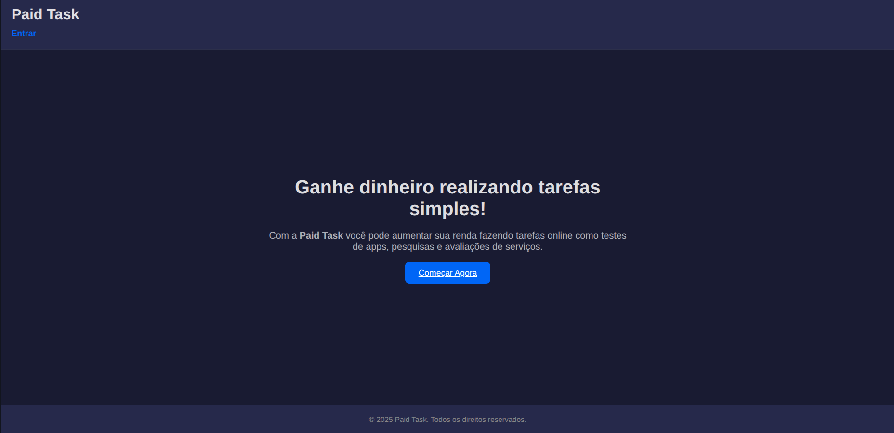

> Projeto Paid Task 
> Uma plataforma moderna para quem quer **ganhar dinheiro realizando tarefas simples** como responder pesquisas, assistir anúncios e testar serviços.

---

## ✨ Recursos

- 🧠 Sistema de Pesquisas
- 🎯 Tarefas Diárias
- 🎁 Recompensas em "Dinheiro"
- 👤 Perfil de Usuário
- 👮 Painel Administrativo com "controle total"
- 📤 Saque de valores acumulados

---

## 📸 Capturas de Tela

### 🏠 Tela Inicial


### 🔐 Login
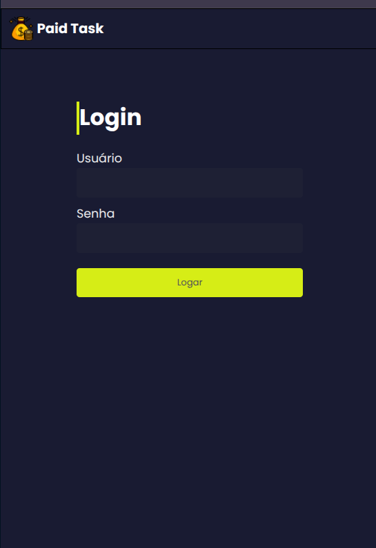

### 👤 Perfil do Usuário


### 📋 Tarefas


### 📊 Pesquisas
| Lista de Pesquisas | Detalhes da Pesquisa |
|--------------------|----------------------|
| 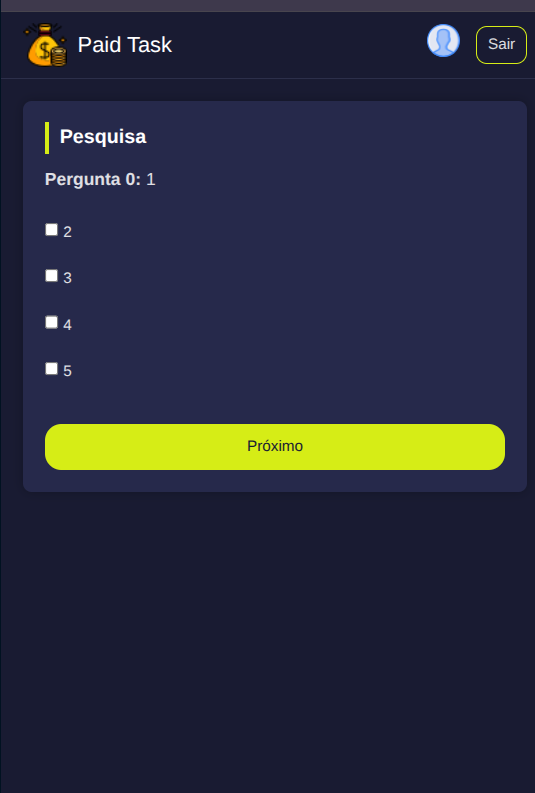 | 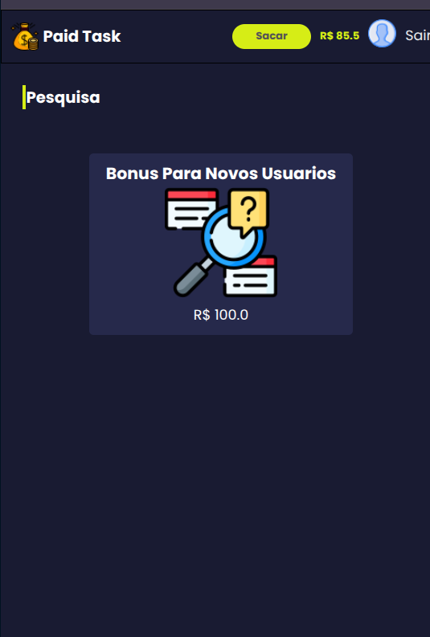 |

### 🎁 Recompensas
| Lista de Recompensas | Exemplo de Recompensa |
|----------------------|------------------------|
| 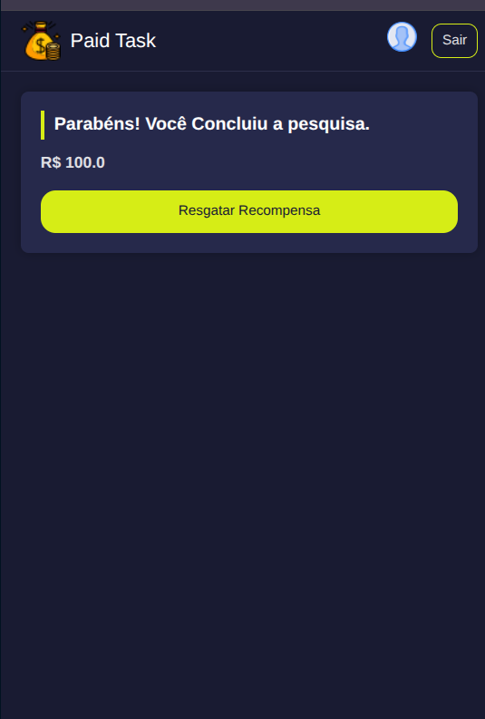 | 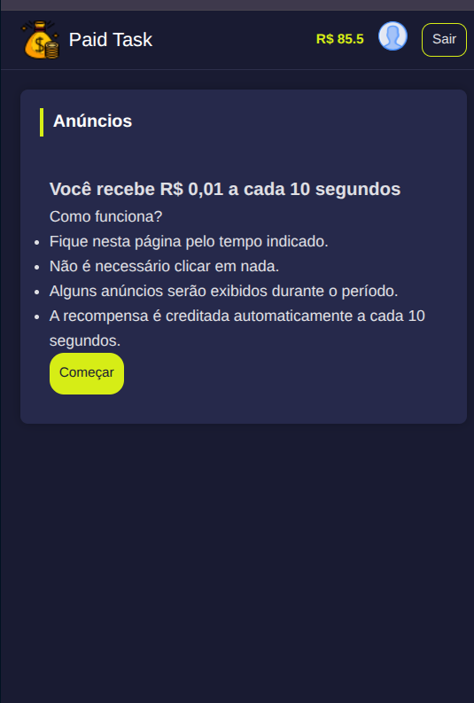 |

### 💸 Saque
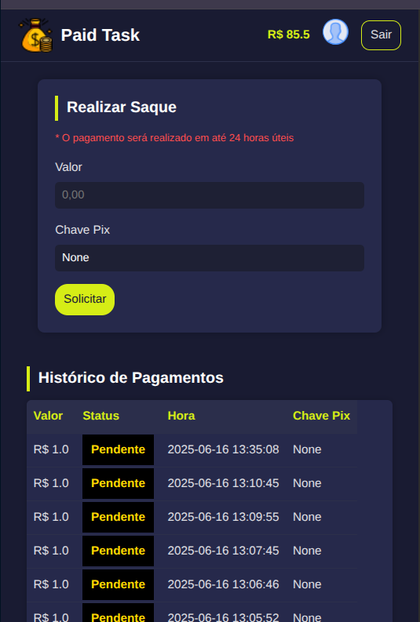

---

## 🛠️ Painel de Administração

### 👥 Gerenciar Usuários
| Lista de Usuários | Criar Novo Usuário |
|--------------------|--------------------|
| 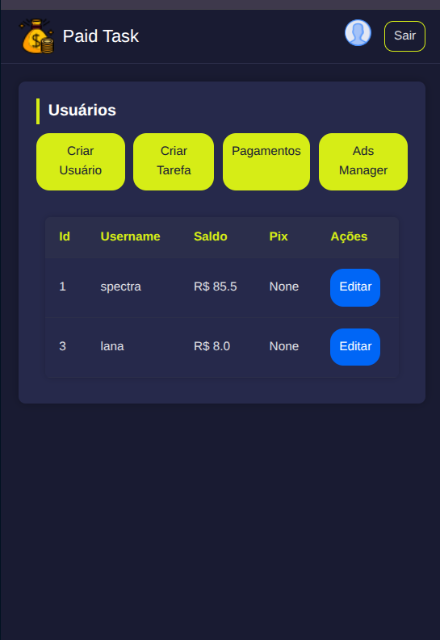 | 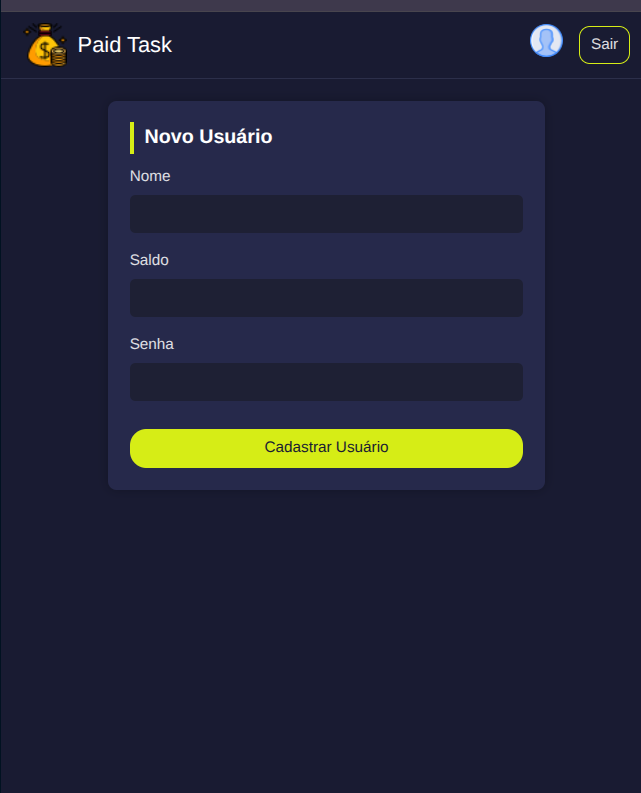 |

### 📋 Gerenciar Tarefas


### 📢 Gerenciar Anúncios
| Lista de Anúncios | Detalhes |
|-------------------|----------|
| 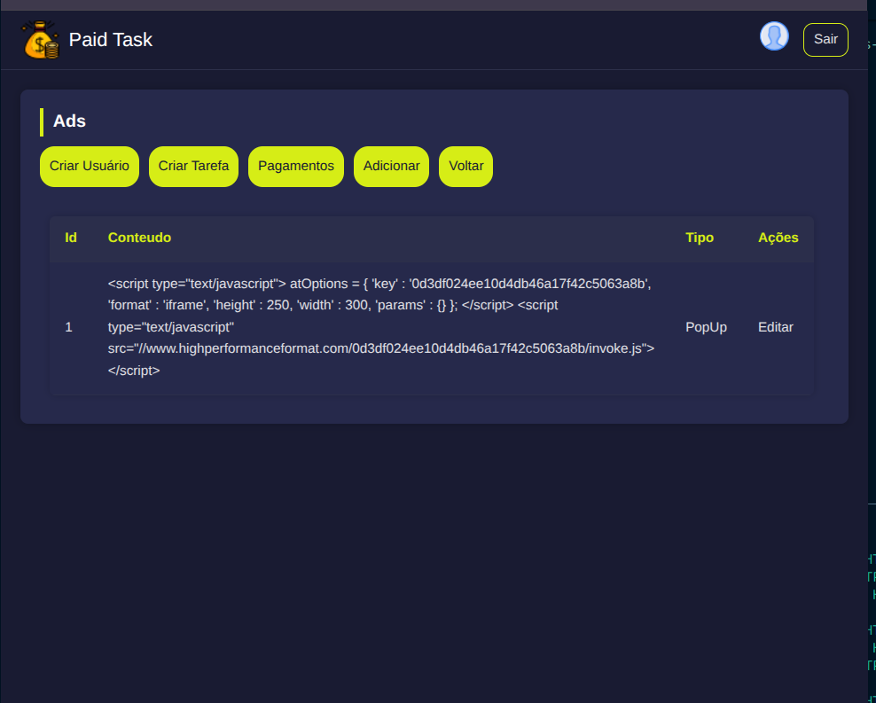 | 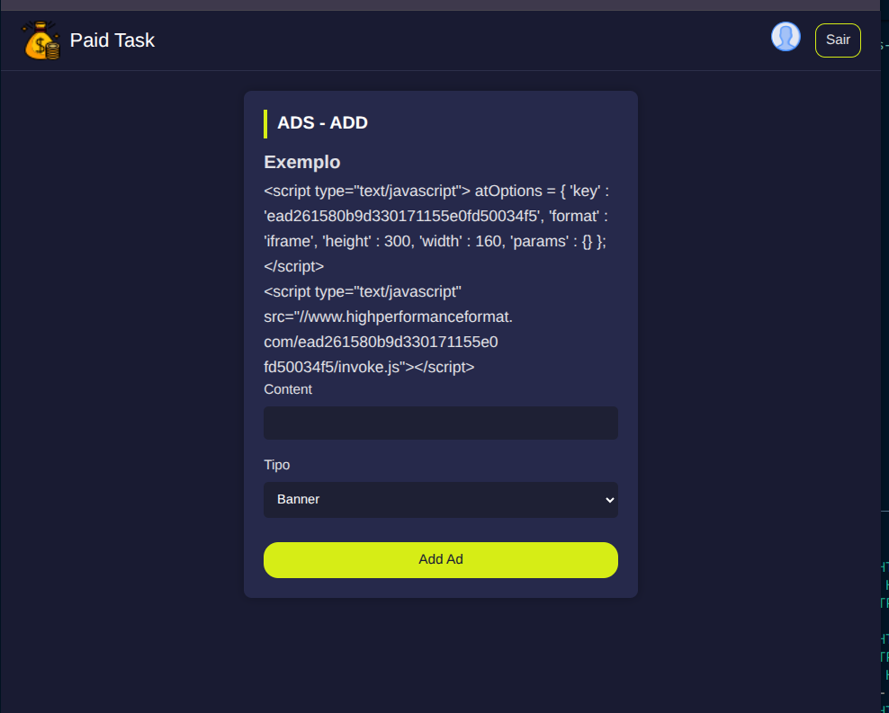 |

### ⚙️ Outros Recursos


---

## 🚀 Começando

### Pré-requisitos
- Python 3.12+
- Flask / SQLAlchemy
- MySQL Server
- Ambiente virtual (recomendado)

### Instalação
```bash
git clone https://github.com/seuusuario/paid-task.git
cd paid-task
python -m venv venv
source venv/bin/activate
pip install -r requirements.txt

